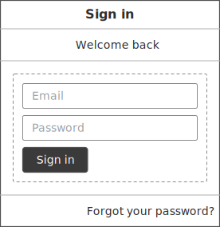
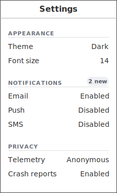
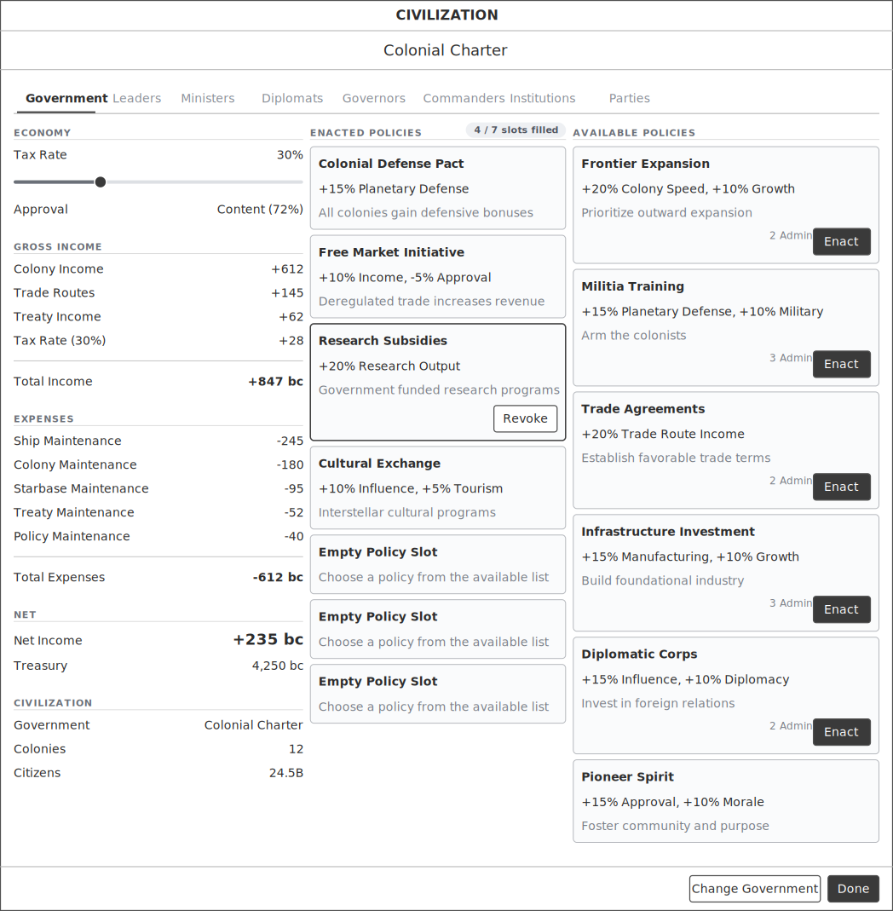
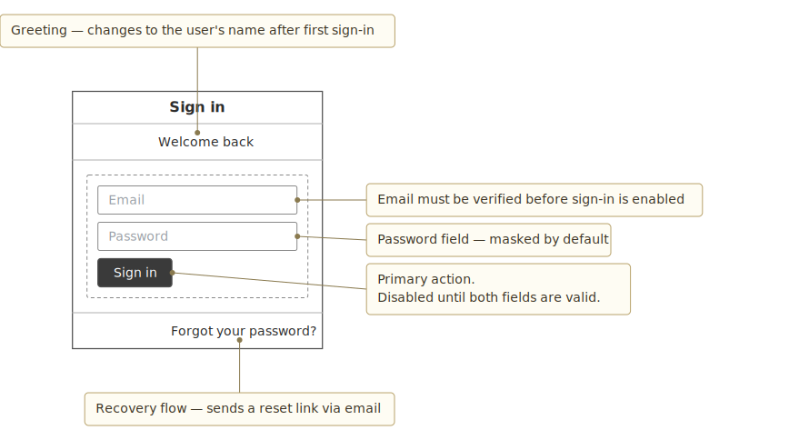

# Wireloom

> **AI-native wireframes, built for Markdown.** A text DSL that any LLM can author directly, rendered inline as SVG.

[](https://opensource.org/licenses/MIT)
[](https://www.npmjs.com/package/wireloom)

Wireloom is a small text-based language for sketching user-interface wireframes. You write the layout as indented plain text inside a fenced code block in any Markdown document, and Wireloom turns it into an SVG diagram that renders inline — in GitHub, Obsidian, Notion, static site generators, or any tool that supports SVG in Markdown.

### Why text-first wireframes

Traditional wireframing tools (Balsamiq, Figma, Whimsical) were designed for humans clicking and dragging. They assume a human is the author. When an AI agent is the author, that interaction model is the wrong shape — the agent wants to emit the layout, not operate a GUI.

Wireloom inverts it. The source is prose-adjacent plain text that an agent can write in one shot from natural language ("mock up a sign-in dialog with email, password, and a primary action"), and the output is self-contained SVG that drops straight into a Markdown document or a chat reply. Low-fidelity by design — the aesthetic reads as a wireframe, not a finished UI, which keeps feedback focused on structure.

Because Wireloom sources are plain text, they live in git, diff cleanly, review in PRs, and version alongside the feature spec. A wireframe can be regenerated from its source forever.

## Status

**v0.4.5 — widgets HTML doesn't have, at wireframe fidelity.** New primitives fill the gaps LLM authors kept simulating with `panel` + `kv` rows: `tree`/`node` (collapsible), `checkbox`/`radio`/`toggle`, `menubar`/`menu`/`menuitem`/`separator`, `chip`, `avatar`, `breadcrumb`/`crumb`, and `spinner`/`status`. All additive — v0.4.1 sources render identically.

v0.4.1 added annotations (callouts): universal `id="…"` on every primitive plus the top-level `annotation` node that draws user-manual-style labels with leader lines.

v0.4.0 added the game-UI primitive set: `grid`/`cell`, `progress`, `chart` (placeholder), `resourcebar`/`resource`, `stats`/`stat`, unified `state=` / `accent=` treatments for slots and cells, slot footers, and a real named icon library.

## What it looks like

A fenced block in Markdown:

~~~markdown
```wireloom
window "Sign in":
  header:
    text "Welcome back"
  panel:
    input placeholder="Email"
    input placeholder="Password" type=password
    button "Sign in" primary
  footer:
    text "Forgot your password?"
```
~~~

Renders as:



No pixel-perfect fidelity; the aesthetic is sketch-style so it reads as a wireframe, not a finished UI.

### A denser example

```wireloom
window "Settings":
  section "Appearance":
    kv "Theme" "Dark"
    kv "Font size" "14"
  section "Notifications" badge="2 new":
    kv "Email" "Enabled"
    kv "Push" "Disabled"
  section "Privacy":
    kv "Telemetry" "Anonymous"
    kv "Crash reports" "Enabled"
```



Sections with optional badges, `kv` label/value rows with flush-right alignment. Add `tabs`, `slot`, `combo`, `slider`, `image`, and `icon` primitives on top of that and you can sketch a full application screen:



The source for that render is in [`examples/11-colonial-charter.wireloom`](examples/11-colonial-charter.wireloom) — a real game-UI stress test used to drive v0.2 fidelity.

### Annotations (v0.4.1)

Add user-manual-style callouts alongside the mockup in the same source:

```wireloom
window "Sign in":
  header:
    text "Welcome back" bold size=large id="welcome"
  panel:
    input placeholder="Email" type=email id="email-field"
    input placeholder="Password" type=password id="password-field"
    row align=right:
      button "Forgot?" id="forgot-btn"
      button "Sign in" primary id="signin-btn"

annotation "Greeting — personalized after first sign-in" target="welcome" position=top
annotation "Email address.\nMust be verified." target="email-field" position=right
annotation "Password field — masked input." target="password-field" position=right
annotation "Password recovery flow." target="forgot-btn" position=left
annotation "Primary action.\nDisabled until form is valid." target="signin-btn" position=right
```



The wireframe and its callouts live in one file and render to one SVG — no separate annotation layer, no second tool.

## Install

```bash
npm install wireloom
```

Works the same with `pnpm add wireloom` or `yarn add wireloom`. Zero runtime dependencies; ships dual ESM/CJS with full TypeScript types. Pin an exact version or tilde (`~0.4.0`) range if you don't want minor bumps: pre-1.0 minor releases may introduce breaking changes to the `Theme` interface or AST shape, though we aim to keep source-level compatibility.

Output is a self-contained SVG string — no `<script>` tags, no external references, all text and attribute values are HTML-escaped. Safe to inject via `innerHTML` / `dangerouslySetInnerHTML`.

## Usage

Four public calls, same shape as other text-to-diagram libraries:

```ts
import wireloom from 'wireloom';

// Optional: configure the global theme once at startup.
wireloom.initialize({ theme: 'default' });

// Render a source string to an SVG string.
const { svg } = await wireloom.render('my-diagram', `
window "Sign in":
  header:
    text "Welcome"
  panel:
    input placeholder="Email"
    input placeholder="Password" type=password
    button "Sign in" primary
`);

document.getElementById('container').innerHTML = svg;
```

Parse without rendering, useful for editors and tooling:

```ts
const doc = wireloom.parse(source); // typed AST
```

Serialize an AST back to canonical source — useful for formatters and structural diffs:

```ts
const canonical = wireloom.serialize(doc);
```

Switch themes per-render without touching global config:

```ts
const { svg } = await wireloom.render('id', source, { theme: 'dark' });
```

Catch parse errors with source positions:

```ts
import { WireloomError } from 'wireloom';

try {
  const { svg } = await wireloom.render('id', source);
} catch (err) {
  if (err instanceof WireloomError) {
    console.error(`Wireloom: line ${err.line}, col ${err.column}: ${err.message}`);
  } else {
    throw err;
  }
}
```

### Inside a Markdown renderer

Short version — hook `wireloom.render` onto the `wireloom` fence language in whatever pipeline you use:

```tsx
// react-markdown
<ReactMarkdown
  components={{
    code({ className, children }) {
      const lang = /language-(\w+)/.exec(className ?? '')?.[1];
      if (lang === 'wireloom') return <WireloomBlock source={String(children)} />;
      // ... your other handlers
    },
  }}
>
  {markdown}
</ReactMarkdown>
```

Full recipes for `remark`/`rehype`, `markdown-it`, `react-markdown`, and plain server-side rendering — plus error-surface patterns, theme selection, SSR notes, and bundle-size details — are in [`INTEGRATION.md`](INTEGRATION.md).

## Why not just use [other thing]?

- **ASCII art** is readable but doesn't render visually and can't be styled.
- **Flowchart DSLs** can't express UI layout — rows, columns, panels, form fields.
- **Wireframing tools** produce images, not text; they don't live in your Markdown, can't be diffed in git, and break when you change tools.

Wireloom is text-first, SVG-output, Markdown-native.

## Design principles

- **Text in, SVG out.** One core call: `render(id, source) → { svg }`.
- **Works anywhere Markdown + SVG works.** No JavaScript runtime required for rendered output.
- **Readable source.** If you squint at a `.wireloom` file, you should be able to see the layout.
- **Small core.** Fewer primitives, composed well. No feature creep.
- **Public package.** MIT-licensed. Built to be depended on.

## Primitive set

29 primitives, grouped:

- **Structural containers**: `window`, `header`, `footer`, `panel`, `section`, `tabs`, `row`, `col`, `list`, `slot`, `grid`, `resourcebar`, `stats`
- **Interactive leaves**: `button`, `input`, `combo`, `slider`, `tab`, `item`
- **Content leaves**: `text`, `kv`, `image`, `icon`, `divider`, `cell`, `resource`, `stat`, `progress`, `chart`

Styling attributes on `text` and `kv` value: `bold` / `italic` / `muted` flags, `weight=light|regular|semibold|bold`, `size=small|regular|large`. `badge="…"` on tabs, sections, and buttons. `align=left|center|right` on rows. `fill` on columns.

v0.4 additions: unified `state=` enum (locked/available/active/purchased/maxed/growing/ripe/withering/cashed) on slots and cells, semantic `accent=` colors (research/military/industry/wealth/approval/warning/danger/success) on slot/section/cell/button/icon, optional `footer:` child on slot, and a named icon library (credits, research, military, industry, lock, check, star, gear, plus more — unknown names fall back to a boxed-letter placeholder).

v0.4.1 additions: **universal `id="…"`** attribute on every primitive, and the **`annotation`** top-level node — a user-manual-style label in the canvas margin with a leader line to an `id`-tagged element. Body text supports `\n` line breaks; required `target="<id>" position=left|right|top|bottom`. Annotations are siblings of `window`, not children.

Full grammar at [`design/grammar.md`](design/grammar.md). Integrating into your own Markdown viewer or docs pipeline? See [`INTEGRATION.md`](INTEGRATION.md).

## Roadmap

- ✅ **v0.1** — Thin slice: `window`, `header`, `footer`, `row`, `col`, `panel`, `text`, `button`, `input`, `divider`. Default theme.
- ✅ **v0.2** — Full v1 token set: `tabs`, `section`, `list`, `slot`, `kv`, `combo`, `slider`, `image`, `icon`, badges, alignment, typography, dark theme, roundtrip serializer.
- ✅ **v0.3** — Published to npm. Flexible 2- or 4-space indentation, "did you mean?" suggestions, targeted `kv` hint.
- ✅ **v0.4** — Game-UI primitives: `grid`/`cell`, `progress`, `chart` placeholder, `resourcebar`, `stats`/`stat`, slot `footer`, unified `state=`/`accent=`, real named icon library.
- ✅ **v0.4.1** — Annotations (callouts): universal `id="…"` attribute, top-level `annotation` node with leader lines to `id`-tagged elements. A single source now renders both a wireframe and its callouts in one SVG.
- **v0.5** — Documentation site with live editor. Visual regression via headless Chromium.
- **v1.0** — Stable public API, ecosystem adapters (`remark-wireloom`, `markdown-it-wireloom`), VS Code extension.

## Contributing

Icons and themes are designed to be **near-zero-friction contributions**. Want to add an icon for a concept we don't cover, or a color theme that matches your product? Both are single-file changes with a documented walkthrough — see [`CONTRIBUTING.md`](CONTRIBUTING.md).

Primitives are a different story: each one is surface area we maintain forever, so new primitives require an issue-first discussion before a PR. Also covered in `CONTRIBUTING.md`.

## Built by the Clairvoyance team

Wireloom was originally built for **[Clairvoyance](https://www.clairvoyanceai.com)** — an AI-native knowledge workspace where AI staff collaborate with you through chat and Markdown notes. Staff needed a way to communicate UI design ideas inline, and no existing tool fit the shape of "agent emits layout, user sees picture." Wireloom was the answer.

If you like the way Wireloom feels — text-first, AI-authorable, Markdown-native — you'll probably like what the same team is building in Clairvoyance. It's where wireloom blocks render inline in live chat, where staff write them unprompted when explaining designs, and where the feedback loop that shaped every primitive in this repo happens every day.

## Links

- GitHub: [StardockCorp/Wireloom](https://github.com/StardockCorp/Wireloom)
- Issues: [github.com/StardockCorp/Wireloom/issues](https://github.com/StardockCorp/Wireloom/issues)
- Clairvoyance: [clairvoyanceai.com](https://www.clairvoyanceai.com)

## License

MIT © 2026 Brad Wardell
